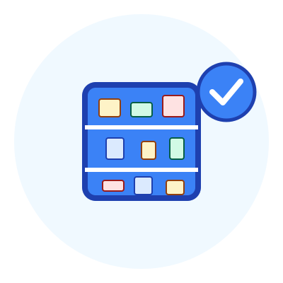
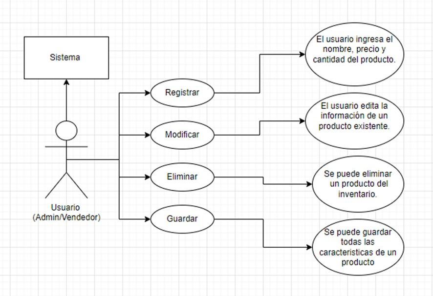
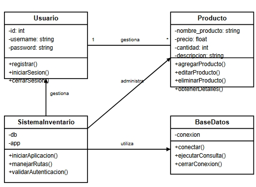
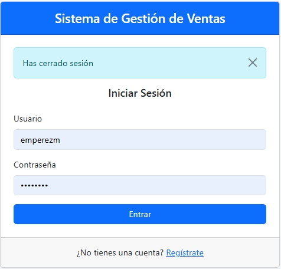
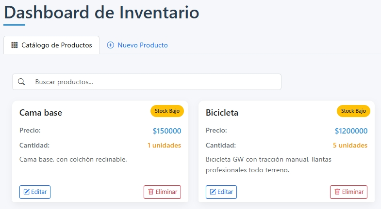
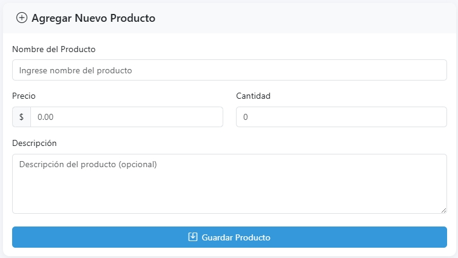

# Sistema de Gestión de Inventario



## Tabla de Contenido

1. [Descripción](#descripción)
2. [Características](#características)
3. [Tecnologías](#tecnologías)
4. [Instalación](#instalación)
5. [Configuración](#configuración)
6. [Estructura del Proyecto](#estructura-del-proyecto)
7. [Diagramas](#diagramas)
8. [Capturas de Pantalla](#capturas-de-pantalla)
9. [Uso](#uso)
10. [Contribuciones](#contribuciones)

## Descripción

Este proyecto es un Sistema de Gestión de Inventario desarrollado con Python y Flask. Permite a los usuarios gestionar un catálogo de productos, llevar un control del stock, y realizar operaciones básicas de administración de inventario a través de una interfaz web intuitiva y moderna.

El sistema ofrece funcionalidades completas de CRUD (Crear, Leer, Actualizar y Eliminar) para productos, junto con un sistema de autenticación para proteger el acceso a la información. Utiliza SQL Server como base de datos para almacenar la información de manera segura, robusta y escalable.

## Características

- **Autenticación de Usuarios**: Sistema de registro e inicio de sesión seguro.
- **Dashboard Interactivo**: Panel principal con visualización clara del inventario.
- **Gestión de Productos**:
  - Añadir nuevos productos al inventario
  - Editar información de productos existentes
  - Eliminar productos del catálogo
  - Visualizar detalles completos de los productos
- **Control de Stock**: Seguimiento de cantidades disponibles con alertas visuales.
- **Interfaz Responsiva**: Diseño adaptable para diferentes dispositivos.
- **Búsqueda y Filtros**: Herramientas para encontrar productos rápidamente.
- **Seguridad**: Protección de rutas mediante middleware de autenticación.

## Tecnologías

- **Backend**:
  - Python 3.8+
  - Flask (Framework web)
  - pyodbc (Driver de SQL Server para Python)
  - Werkzeug (Utilidades de seguridad)

- **Frontend**:
  - HTML5, CSS3, JavaScript
  - Bootstrap 5.3 (Framework CSS)
  - Bootstrap Icons (Iconografía)
  
- **Base de Datos**:
  - Microsoft SQL Server (Base de datos relacional)

- **Herramientas de Desarrollo**:
  - Visual Studio Code
  - Git (Control de versiones)

## Instalación

1. **Clonar el repositorio**:
   ```bash
   git clone https://github.com/emperezm/Producto_mongodb.git
   cd Producto_mongodb
   ```

2. **Crear y activar entorno virtual**:
   ```bash
   # En Windows
   python -m venv venv
   venv\Scripts\activate
   
   # En macOS/Linux
   python3 -m venv venv
   source venv/bin/activate
   ```

3. **Instalar dependencias**:
   ```bash
   pip install -r requirements.txt
   ```

4. **Instalar SQL Server**:
   - Descargar e instalar [SQL Server Express](https://www.microsoft.com/es-es/sql-server/sql-server-downloads)
   - Instalar [SQL Server Management Studio (SSMS)](https://docs.microsoft.com/es-es/sql/ssms/download-sql-server-management-studio-ssms) para administrar la base de datos

## Configuración

1. **Configurar la conexión a SQL Server**:

   Asegúrate de que el archivo `database.py` esté correctamente configurado:

   ```python
   import pyodbc

   def dbConnection():
       try:
           conn_str = (
               "DRIVER={SQL Server};"
               "SERVER=localhost\\SQLEXPRESS;"
               "DATABASE=Productos;"
               "Trusted_Connection=yes;"
           )
           conn = pyodbc.connect(conn_str)
           return conn
       except Exception as e:
           print(f"Error de conexión a SQL Server: {e}")
           return None
   ```

   Ajusta los parámetros de conexión según tu configuración de SQL Server.

2. **Crear la base de datos y tablas**:

   Ejecuta el siguiente script SQL en SQL Server Management Studio:

   ```sql
   -- Crear la base de datos
   CREATE DATABASE Productos;
   GO

   USE Productos;
   GO

   -- Crear tabla de usuarios
   CREATE TABLE Usuarios (
       id INT IDENTITY(1,1) PRIMARY KEY,
       username VARCHAR(50) NOT NULL UNIQUE,
       password VARCHAR(255) NOT NULL,
       created_at DATETIME NOT NULL
   );
   GO

   -- Crear tabla de inventario
   CREATE TABLE Inventario (
       nombre_producto VARCHAR(50) PRIMARY KEY,
       precio DECIMAL(18, 0) NOT NULL,
       cantidad INT NOT NULL,
       descripcion VARCHAR(100)
   );
   GO
   ```

3. **Configurar variables de entorno** (opcional):

   Crea un archivo `.env` en la raíz del proyecto:

   ```
   FLASK_APP=app.py
   FLASK_ENV=development
   SECRET_KEY=ProyectoSENA25Abril
   ```

## Estructura del Proyecto

```
sistema-inventario/
│
├── app.py                  # Punto de entrada principal
├── database.py             # Configuración de conexión a la base de datos
├── product.py              # Modelo de producto
│
│
├── templates/              # Plantillas HTML
│   ├── index.html          # Dashboard principal
│   ├── login.html          # Página de inicio de sesión
│   └── register.html       # Página de registro
│
└── README.md               # Documentación del proyecto
```
## Diagramas


*Diagrama de casos de uso.*



*Diagrama de clases.*

## Capturas de Pantalla

### Inicio de Sesión


*Pantalla de autenticación para acceder al sistema.*

### Dashboard de Inventario


*Panel principal con listado de productos, indicadores de stock y opciones de gestión.*

### Formulario de Producto


*Interfaz para agregar o modificar información de productos en el inventario.*

## Uso

1. **Iniciar el servidor**:
   ```bash
   python app.py
   ```

2. **Acceder a la aplicación**:
   - Abre tu navegador y visita: `http://localhost:4200`
   - Regístrate para crear una nueva cuenta
   - Inicia sesión para acceder al dashboard

3. **Gestión de Productos**:
   - **Añadir**: Navega a la pestaña "Nuevo Producto" y completa el formulario
   - **Editar**: Haz clic en el botón "Editar" junto a un producto para modificar sus detalles
   - **Eliminar**: Haz clic en "Eliminar" para quitar un producto del inventario
   - **Visualizar**: Todos los productos se muestran en la página principal con su información relevante

4. **Búsqueda de Productos**:
   - Utiliza el campo de búsqueda para filtrar productos por nombre o descripción
   - Cambia entre vista de cuadrícula o lista según tus preferencias

## Contribuciones

Las contribuciones son bienvenidas. Si deseas mejorar este proyecto, sigue estos pasos:

1. Haz un Fork del repositorio
2. Crea una nueva rama (`git checkout -b feature/nueva-caracteristica`)
3. Realiza tus cambios y haz commit (`git commit -m 'Añadir nueva característica'`)
4. Sube tus cambios (`git push origin feature/nueva-caracteristica`)
5. Abre un Pull Request
6. Para mayor información puedes contactarme al correo electrónico mari-perez36@hotmail.com

---

Desarrollado por Mariana Pérez Montalvo como proyecto para el curso GITHUB del SENA © 2025